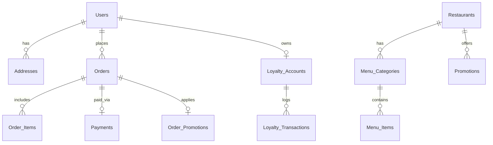

# PRD — Single Restaurant Delivery App
(Uber Eats alternative without marketplace fees)

## Table of Contents
1. [Product Overview](#1-product-overview)
2. [Target Users](#2-target-users)
3. [MVP Feature Set](#3-mvp-feature-set)
4. [Restaurant Dashboard](#4-restaurant-dashboard)
5. [Core Database Schema (12-Table)](#5-core-database-schema-12-table)
6. [Order Lifecycle](#6-order-lifecycle)
7. [Payments](#7-payments)
8. [Delivery Logic (MVP)](#8-delivery-logic-mvp)
9. [Tech Stack (AI Native)](#9-tech-stack-ai-native)
10. [Success Metrics](#10-success-metrics)
11. [V2 Features (Later)](#11-v2-features-later)
12. [Real Strategic Insight](#12-real-strategic-insight)

---

> **UX Blueprints (per-tenant):** Screen flows, component architecture, and interaction rules live in tenant-specific docs.
> See [`Docs/tenants/`](./tenants/) — e.g. [Phuket Thai UX Blueprint](./tenants/phuket-thai/UX_Blueprint.md).
> New tenants: copy [`_tenant_template/`](./tenants/_tenant_template/) as a starting point.

---

## 1. Product Overview

**Product Name:** Restaurant Direct

**Purpose:** Enable a restaurant to accept direct delivery and pickup orders through its own branded app, avoiding marketplace commissions.

Typical marketplaces charge 20–35% per order. This system allows restaurants to pay only payment processing + delivery cost.

**Core principle:**
* One restaurant.
* One menu.
* Direct ordering.

---

## 2. Target Users

### Customers
People ordering food.

**Needs:**
* Fast ordering
* Easy payment
* Order tracking
* Saved addresses

### Restaurant Staff
**Needs:**
* See incoming orders
* Manage menu
* Update order status
* Manage hours

### Delivery Drivers (Optional MVP)
**Needs:**
* See delivery jobs
* Navigation
* Confirm delivery

---

## 3. MVP Feature Set

### Customer App

**Core features:**
* **Menu browsing**
  * Restaurant → Categories → Items → Options
  * *Example:*
    * Burgers (Cheeseburger, Double Burger)
    * Drinks (Coke, Sprite)

* **Cart**
  * Customers can: add items, customize options, change quantity
  * *Cart example:*
    * 1x Double Burger (+ Cheese, + Bacon)
    * 1x Coke

* **Checkout**
  * Customer enters: Name, Phone, Address, Delivery / Pickup.
  * Payment options based on fulfillment:
    * **Delivery**: Online payment required (Stripe).
    * **Pickup (Collection)**: Choice of Online payment or Pay In-Store.

* **Order Tracking**
  * Order status: Pending, Confirmed, Preparing, Ready, Out for delivery, Delivered

### First-Time User Onboarding

When a new user opens the app for the first time:

• Display a welcome loyalty incentive
• Highlight popular dishes
• Encourage the first order

Home screen modules must prioritize:

- loyalty signup incentive
- social proof ("Most Loved")
- frictionless item discovery

---

## 4. Restaurant Dashboard

Restaurant staff needs very simple tools.

### Orders Screen
Live order feed: New Orders, Preparing, Ready, Completed.

*Example:*
* Order #2041 (2x Burgers, 1x Chips, Delivery)
* Buttons: Accept, Start Preparing, Ready, Completed
* For **Collection + Pay In-Store** orders, an additional "Mark Paid & Complete" action enables staff to collect payment at pickup.

### Menu Management
Restaurant can: Create categories, Add items, Edit prices, Enable / disable items.

### Opening Hours
*Example:*
* Monday - Thursday 11:00 - 20:00
* Friday - Saturday 11:00 - 20:30
* Sunday 11:00 - 20:00

---

## 5. Core Database Schema (12-Table)

This schema supports: single restaurant, multi restaurant, delivery, pickup, promotions, and loyalty without needing redesign later.

### 1. Users (`users`)
All customers.

| field | type |
|-------|------|
| id | uuid |
| name | text |
| email | text |
| phone | text |
| password_hash | text |
| created_at | timestamp |

### 2. Addresses (`addresses`)
Customers can have multiple addresses.

| field | type |
|-------|------|
| id | uuid |
| user_id | uuid |
| label | text *(Home / Work)* |
| street | text |
| city | text |
| postal_code | text |
| latitude | float |
| longitude | float |
| created_at | timestamp |

### 3. Restaurants (`restaurants`)
Even if starting with one restaurant, keep this table. Future-proofs expansion.

| field | type |
|-------|------|
| id | uuid |
| name | text |
| description | text |
| phone | text |
| email | text |
| address | text |
| opening_hours | text/json |
| is_active | boolean |
| created_at | timestamp |

### 4. Menu Categories (`menu_categories`)
*Example: Burgers, Pizza, Drinks, Desserts*

| field | type |
|-------|------|
| id | uuid |
| restaurant_id | uuid |
| name | text |
| display_order | int |
| created_at | timestamp |

### 5. Menu Items (`menu_items`)
The products.

| field | type |
|-------|------|
| id | uuid |
| restaurant_id | uuid |
| category_id | uuid |
| name | text |
| description | text |
| price | decimal |
| image_url | text |
| is_available | boolean |
| created_at | timestamp |

### 6. Orders (`orders`)
The main transaction record. Typical statuses: pending, confirmed, preparing, ready, completed, cancelled.

| field | type |
|-------|------|
| id | uuid |
| customer_id | uuid |
| restaurant_id | uuid |
| status | text |
| order_type | text *(pickup/delivery)* |
| subtotal | decimal |
| delivery_fee | decimal |
| tax | decimal |
| total_price | decimal |
| payment_status | text |
| created_at | timestamp |

### 7. Order Items (`order_items`)
Each item inside the order. 
**Important:** price is copied at purchase time. This prevents issues when menu prices change later.

| field | type |
|-------|------|
| id | uuid |
| order_id | uuid |
| menu_item_id | uuid |
| item_name | text |
| price | decimal |
| quantity | int |
| total_price | decimal |

### 8. Payments (`payments`)
Payment tracking. Serves as the canonical ledger of money events for both online (Stripe) and in-store payments.

| field | type |
|-------|------|
| id | uuid |
| order_id | uuid |
| provider | text *(stripe / in_store)* |
| method | text *(card_online / cash / card_in_store)* |
| provider_payment_id | text *(nullable)* |
| amount | decimal |
| currency | text |
| status | text *(intent_created / processing / succeeded / failed)* |
| created_at | timestamp |
| updated_at | timestamp |
| collected_at | timestamp *(nullable, for in-store)* |
| collected_by_user_id | uuid *(nullable, staff accountability)* |

### 9. Promotions (`promotions`)
Discount campaigns. *Example: SAVE10, 10% off, Minimum order $20*

| field | type |
|-------|------|
| id | uuid |
| restaurant_id | uuid |
| code | text |
| discount_type | text *(percent/fixed)* |
| discount_value | decimal |
| min_order_amount | decimal |
| expires_at | timestamp |
| is_active | boolean |

### 10. Order Promotions (`order_promotions`)
Tracks which promotion was used.

| field | type |
|-------|------|
| id | uuid |
| order_id | uuid |
| promotion_id | uuid |
| discount_amount | decimal |

### 11. Loyalty Accounts (`loyalty_accounts`)
Customer loyalty points.

| field | type |
|-------|------|
| id | uuid |
| customer_id | uuid |
| points_balance | int |
| created_at | timestamp |

### 12. Loyalty Transactions (`loyalty_transactions`)
Tracks points earned or spent.

| field | type |
|-------|------|
| id | uuid |
| loyalty_account_id | uuid |
| order_id | uuid |
| points | int |
| type | text *(earn/redeem)* |
| created_at | timestamp |

---

### Visual ER Diagram



### Why This Schema Works So Well
This structure handles:
* **Order history:** Orders remain accurate even if menu changes.
* **Restaurant analytics:** You can calculate top selling items, average order value, repeat customers.
* **Promotions:** You can answer: Which promo generated the most revenue?
* **Loyalty:** You can track points earned, points redeemed.

#### A Hidden Scaling Trick (Very Important)
When platforms like Uber Eats scale, they add an `order_status_history` table:
* `id`
* `order_id`
* `status`
* `created_at`

This enables detailed analytics, delivery tracking over time, and robust customer notifications.

---

## 6. Order Lifecycle

**State machine:**
```
PENDING → CONFIRMED → PREPARING → READY → OUT_FOR_DELIVERY → DELIVERED
```

---

## 7. Payments

**Recommended MVP:**
* Payment providers: Stripe, PayFast (popular in South Africa)

**Payment flow:**
```
Customer checkout → Create payment intent → Payment success → Create order
```

---

## 8. Delivery & Fulfillment Logic (MVP)

Two modes.

### Pickup (Collection)
* Customer collects from the restaurant.
* Delivery fee: `0`
* Payment terms: Customer can choose to pay online (Stripe) or **Pay In-Store** (cash/card at the counter).

### Restaurant Delivery
* Restaurant driver delivers to customer.
* Delivery fee: `flat fee` (example: R25)
* Payment terms: Online payment strongly required in MVP (no cash on delivery).

**Later:** distance based pricing.

---

## 9. Tech Stack (AI Native)

Modern stack most YC companies use:

* **Frontend Web:** Next.js, Tailwind
* **Mobile:** Flutter
* **Backend:** Supabase
  * *Includes:* PostgreSQL, auth, storage, realtime
* **Maps:** Google Maps API
* **Payments:** Stripe / SnapScan / Ozow (Instant EFT) / PayFast

---

## 10. Success Metrics

### Restaurant metrics:
* Orders per day
* Average order value
* Delivery time

### Customer metrics:
* Conversion rate
* Cart abandonment
* Repeat orders

---

## 11. V2 Features (Later)

After MVP works:

* **Loyalty program:** Earn points, Free meals
* **Scheduled orders:** Order for later
* **Delivery driver app:** Driver receives jobs.
* **Multi-restaurant platform:** Turn it into a marketplace later.

---

## 12. Real Strategic Insight

This model is exploding right now because restaurants hate marketplace fees.

Companies like Uber Eats and DoorDash take 20–35% commission.
Restaurants are moving toward:
* Direct ordering
* Direct customer ownership
